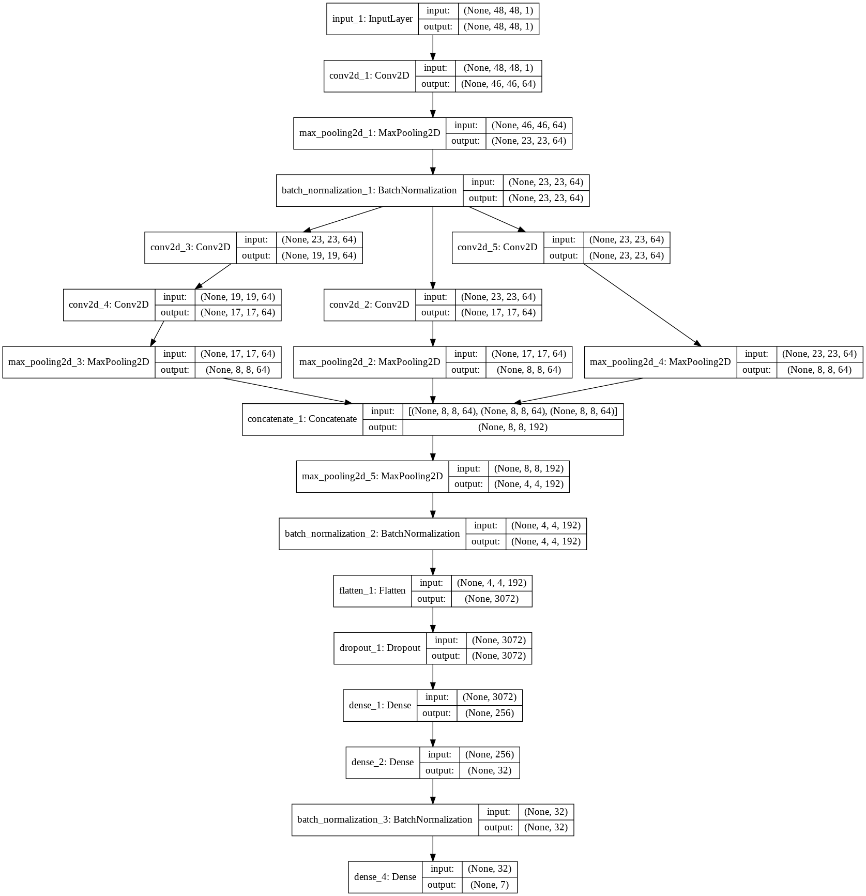
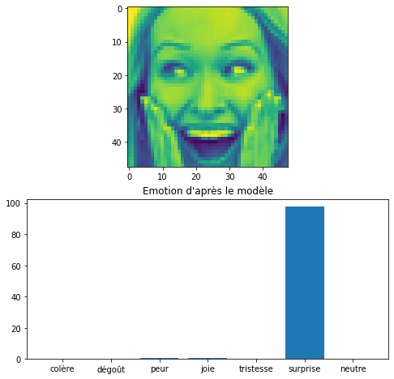
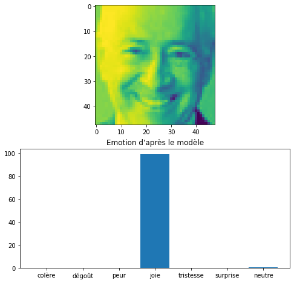
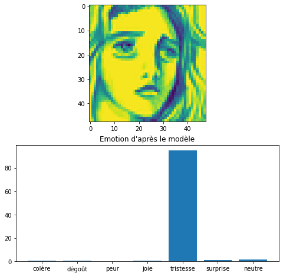
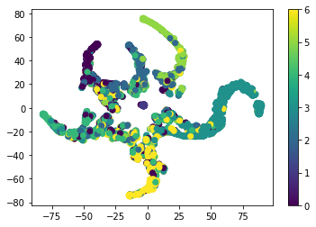

# Emotion recognition with neural network

datasets : [CKplus](https://www.kaggle.com/shawon10/ckplus), [FER2013](https://www.kaggle.com/ahmedmoorsy/facial-expression), [KDEF](https://www.kdef.se/index.html)

<ins>Test accuracy : </ins>

| CKplus | FER2013 | KDEF |
| :----: | :-----: | :--: |
| 100 %  |   67%   | 60%  |

 

## Architecture of the CNN

## Examples of results 

Latent space of the network for a training with 2 emotions :

Latent space of the network for a training with 7 emotions :

